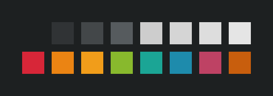

# base16-helios-scheme

  

Somewhat inspired by gruvbox, Helios is a dark, saturated base16 scheme with nice clean colors.

## Installing
1. Install a base16 builder. I like [pybase16](https://github.com/InspectorMustache/base16-builder-python), so that's the one I'm going to use in these instructions
2. Make a folder to hold all of the builder files. For example, ~/base16
3. In that folder, run `pybase16 update`. This will download all of the official base16 schemes and templates
4. Now that all of the official schemes are downloaded, run `pybase16 build -s helios`
5. There will now be an `output` folder with all of the generated themes for various applications

Alternatively, if you don't want to mess with builders, I went ahead and generated all of the output themes myself and uploaded them to another repo [here](https://github.com/reyemxela/base16-helios-exported-themes)
